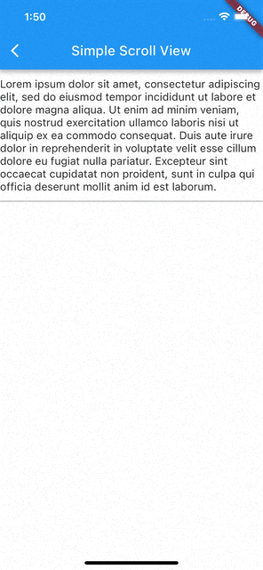

[](https://stand-with-ukraine.pp.ua)

# Cupertino Interactive Keyboard

A Flutter plugin intended to achieve native iOS [interactively dismissible keyboard](https://developer.apple.com/documentation/uikit/uiscrollview/keyboarddismissmode/interactive).
It can be used as temporary solution while we are waiting [this issue](https://github.com/flutter/flutter/issues/57609) to be resolved by the Flutter team 🙏.
On other side, this plugin doesn't rely on questionable keyboard screenshot approach, so it is expected to work more solid.




## Getting Started

The `CupertinoInteractiveKeyboard` defines the area where the draggable keyboard is enabled.
Using scrollable widget as its child is optional.

```dart
CupertinoInteractiveKeyboard(
  child: ListView.builder(
    ...
  ),
);
```

In chat-like UI where you have input bar attached to bottom, you can use the `CupertinoInputAccessory` widget.
It designed to use its child's height as native [input accessory view](https://developer.apple.com/documentation/uikit/uiresponder/1621119-inputaccessoryview) size.

```dart
CupertinoInputAccessory(
  child: TextField(
    ...
  ),
);
```

See the [full example](example/lib) of complete implementation.
